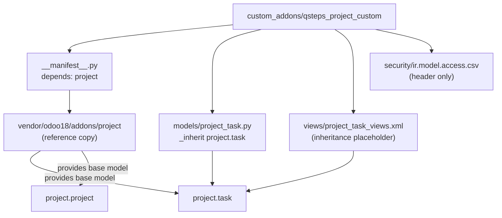

# Odoo 18 Project Module Structure Map

## 1. Purpose of This Document
This document maps:
- the **reference location** for the Odoo 18 Community `project` module under `vendor/odoo18/addons/project`, and
- our **customization module** under `custom_addons/qsteps_project_custom`.

Its purpose is to help developers implement changes safely in the custom addon without editing vendor/reference files directly.

> Important current state: the vendor `project` module is not populated in this repository snapshot; only a placeholder file exists that explicitly says the module could not be fetched due to GitHub 403. This means file-level mapping for vendor internals is pending until the source is added.

## 2. Repository Layout

```text
.
├── vendor/
│   └── odoo18/
│       └── addons/
│           └── project/
│               └── .placeholder
├── custom_addons/
│   └── qsteps_project_custom/
│       ├── __init__.py
│       ├── __manifest__.py
│       ├── models/
│       │   ├── __init__.py
│       │   └── project_task.py
│       ├── security/
│       │   └── ir.model.access.csv
│       └── views/
│           └── project_task_views.xml
└── docs/
    └── ODOO_PROJECT_MODULE_MAP.md
```

## 3. Original Odoo Project Module Reference

### Current repository status
`vendor/odoo18/addons/project` currently contains only `.placeholder`. No `__manifest__.py`, `models/`, `views/`, `security/`, `data/`, `report/`, `controllers/`, `static/`, or `wizard/` files are present in-repo yet.

### Expected role once vendor copy is available
When the official Odoo module is copied in, these folders/files typically serve:
- `__manifest__.py`: module metadata, dependencies, load order (data/views/security/demo).
- `models/`: core business objects (e.g., project, task, stages, tags, collaborators, etc.).
- `views/`: form/tree/kanban/search/calendar/activity/cohort and menus/actions.
- `security/`: access rights CSV + groups + record rules.
- `data/`: base data, defaults, mail templates, cron/server actions.
- `report/`: QWeb/PDF report actions and templates.
- `controllers/`: website/portal/http endpoints.
- `static/`: JS/CSS/XML assets, icons, web client resources.
- `wizard/` (if exists): transient models and flows for guided actions.

## 4. Main Models

Because vendor source files are unavailable in this repo snapshot, only custom addon models can be mapped concretely.

| File path | Model name | Purpose | Important fields/methods |
|---|---|---|---|
| `custom_addons/qsteps_project_custom/models/project_task.py` | `project.task` (inherited) | Declares extension hook for future task customizations. | `_inherit = "project.task"`; no custom fields/methods yet. |

> Vendor model table is pending population once `vendor/odoo18/addons/project` is added.

## 5. Main Views

| File path | View type | Model affected | Purpose |
|---|---|---|---|
| `custom_addons/qsteps_project_custom/views/project_task_views.xml` | Odoo XML data container (currently empty) | None yet | Placeholder for future inherited `project.task` view extensions. |

> Vendor view mapping is pending because vendor XML files are not present.

## 6. Portal Components

- No portal-related files are currently present under `vendor/odoo18/addons/project` in this repository snapshot.
- No portal controllers/templates are currently present in `custom_addons/qsteps_project_custom`.

### How portal task/project views are typically handled (target architecture)
Once vendor code is available, portal behavior is usually split between:
- `controllers/` python routes for portal pages/actions.
- `views/*portal*.xml` QWeb templates for task/project portal rendering.
- security record rules restricting portal users to allowed project/task records.

## 7. Reports

- No report files are currently present under vendor `project` in this repository snapshot.
- No report files are currently present in `custom_addons/qsteps_project_custom`.

Planned extension pattern:
- add `report/*.xml` in custom addon for report action/template inheritance or new task/project reports.

## 8. Security and Access Rights

### Vendor (reference copy)
- Not currently available in-repo; cannot enumerate `ir.model.access.csv`, groups, or record rules yet.

### Custom addon
- `security/ir.model.access.csv` contains only the CSV header and no access rows yet.
- No `security/*.xml` group/rule definitions currently exist.

Implication:
- The custom addon currently grants no additional explicit ACLs of its own.

## 9. Custom Addon Map

### `__manifest__.py`
- Depends on: `project`.
- Loads:
  - `security/ir.model.access.csv`
  - `views/project_task_views.xml`

### `models/project_task.py`
- Minimal inheritance shell of `project.task`.
- Safe place to add custom fields/methods for accreditation workflows.

### `views/project_task_views.xml`
- Empty `<data>` block; ready for inherited view definitions.

### `security/ir.model.access.csv`
- Header only; needs concrete ACL entries only if new models are added.

### Missing or empty files needing future implementation
- Empty: `views/project_task_views.xml`.
- Empty (header-only): `security/ir.model.access.csv`.
- Missing likely future files:
  - `security/security.xml` (groups/record rules)
  - `report/*.xml`
  - optional `controllers/*.py` + portal templates if portal customization is required
  - additional `models/*.py` as domain grows.

## 10. Safe Customization Strategy

1. **Never edit** `vendor/odoo18/addons/project` directly.
2. Extend behavior by `_inherit` in `custom_addons/qsteps_project_custom/models/*.py`.
3. Extend UI via inherited XML views in `custom_addons/qsteps_project_custom/views/*.xml`.
4. Add fields on inherited models in custom addon only.
5. Add groups/rules/ACLs in custom addon `security/` only.
6. Keep custom data/report logic in custom addon to reduce upgrade risk.

## 11. Recommended Customization Points for Our Accreditation Project

> Since vendor file-level targets are not yet present locally, the file names below are expressed as **likely target areas** to validate once vendor module files are added.

1. **Evidence Type on `project.task`**
   - Extend model: `custom_addons/qsteps_project_custom/models/project_task.py`.
   - Extend task form/tree views: `custom_addons/qsteps_project_custom/views/project_task_views.xml`.

2. **Evidence Attachment on `project.task`**
   - Model field(s) on task (possibly relation to `ir.attachment` or binary helper fields).
   - Task form view inheritance in custom addon.
   - Optional portal template inheritance if customer uploads are needed.

3. **Challenge Type on `project.task`**
   - Add selection/m2o taxonomy field in custom model inheritance.
   - Add filters/group-by in inherited search view.

4. **Project Buckets / Major Projects**
   - Likely extend `project.project` model in new custom model file.
   - Add project form/list/search inherited views in custom addon.
   - Add security visibility rules if bucket ownership is role-specific.

5. **Leadership Dashboard**
   - Add aggregated KPI fields/models and menu/action items.
   - Likely custom tree/graph/pivot views + search filters.

6. **Portal task view improvements**
   - Inherit portal QWeb templates (once identified in vendor module).
   - Add/adjust portal routes only in custom controllers.
   - Validate record rules for portal user visibility.

7. **Task list view improvements**
   - Inherit task tree/kanban/search views in custom addon XML.
   - Add useful columns, badges, domains, and filters.

8. **Printable progress report**
   - Add custom `report/*.xml` action/template.
   - Optionally include project + task completion metrics and evidence metadata.

## 12. Developer Notes

- **Safe to edit now**:
  - anything under `custom_addons/qsteps_project_custom/`
  - documentation under `docs/`
- **Reference-only**:
  - `vendor/odoo18/addons/project/` (and once populated, still treat as read-only).
- **How to locate inherited views (once vendor files exist)**:
  - search by `inherit_id`, `model="project.task"`, `model="project.project"`, xml ids, and action/menu ids.
- **Upgrade safety**:
  - avoid monkey patching/replacing base views wholesale;
  - prefer narrowly targeted XPath inheritance;
  - isolate new business logic in custom module;
  - keep security deltas explicit and minimal.

## Mermaid Dependency Map


